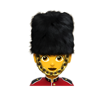
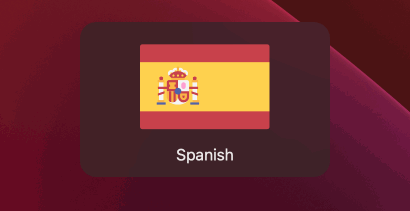

# LanguageFlag

LanguageFlag is a handy tool that displays a language flag on the screen whenever you change your keyboard layout. This utility can be useful for users who regularly work with different languages and keyboard layouts on their Mac, as it provides a visual indicator of the current layout in use.

LanguageFlag works on macOS Catalina 10.15 or higher.

## Usage

All you need to do is change the keyboard layout, and a flag corresponding to the new language will magically appear on your screen. This way, you can keep track of which language you're using without missing a beat.

## License

[MIT](./LICENSE)